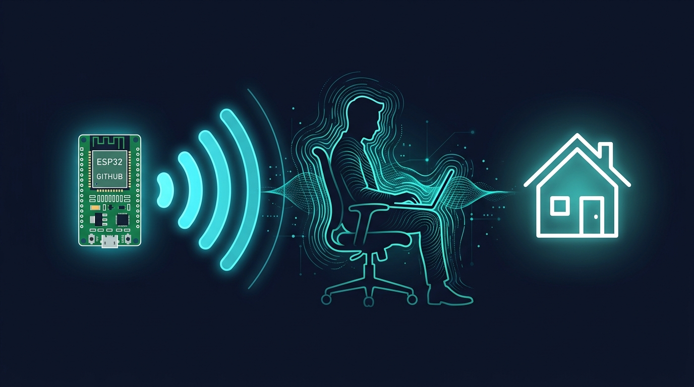
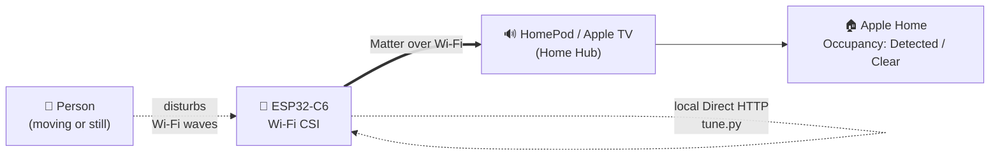

<div align="center">



# ESP32-C6 → camera-free presence sensor in Apple Home

[](https://www.espressif.com/en/products/socs/esp32-c6)
[](https://www.apple.com/home-app/)
[](https://csa-iot.org/all-solutions/matter/)
[](https://github.com/espressif/esp-csi)
[](LICENSE)
[](https://github.com/tuncasoftbildik/esp32c6-wifi-csi-apple-home)

</div>

Turn a cheap **ESP32-C6** board into a **camera-free, PIR-free occupancy sensor**
that appears natively in **Apple Home** over Matter — no hub bridge, no Home
Assistant required. It uses **Wi-Fi CSI** (Channel State Information) to sense a
person from how their body disturbs Wi-Fi radio waves, so unlike a PIR motion
sensor it can also detect a **person sitting still**.

This repo is a **field guide + helper scripts**. The firmware itself is the
excellent open-source [**ESPectre**](https://github.com/francescopace/espectre)
project — this repo documents how to get it flashed, provisioned, tuned, and
paired to Apple Home entirely from the command line, plus every real-world
gotcha that stands between "flashed" and "actually detects people."

> Measured result in a real room: **idle score ≈ 0.001, walking ≈ 0.94**,
> a ~900× separation, reported to Apple Home as occupancy `Detected / Clear`.

---

## Why this is interesting

| | PIR motion | BLE presence | mmWave | **Wi-Fi CSI (this)** |
|---|---|---|---|---|
| Moving person | ✅ | ~ | ✅ | ✅ |
| **Still, seated person** | ❌ | ~ | ✅ | ✅ |
| Phone-less person | ✅ | ❌ | ✅ | ✅ |
| Ignores a laptop on the desk | ✅ | ❌ | ✅ | ✅ |
| Extra hardware cost | low | — | mid | **€0 (reuses a board)** |
| Camera / privacy exposure | none | none | none | **none** |

CSI reads the amplitude/phase distortion of ordinary Wi-Fi packets, so there is
no camera and no microphone — just the radio the chip already has.

## How it works



## Hardware

- Any **ESP32-C6** board. This guide was built on a **Waveshare
  ESP32-C6-LCD-1.47** (the on-board screen is not used — a broken screen is
  fine). ESP32-C3 / C5 / S3 / classic ESP32 are also supported by ESPectre.
- A **2.4 GHz Wi-Fi** network (the C6 radio is 2.4 GHz only).
- For the Apple Home step: a **Home Hub** — HomePod / HomePod mini / Apple TV.
  Apple requires one to add any Matter accessory.

Current helper-script release: **v0.1.0**. See [CHANGELOG.md](CHANGELOG.md).
This version is independent of the ESPectre firmware version.

## What's in this repo

| File | Purpose |
|---|---|
| `scripts/provision.py` | Headless Wi-Fi provisioning over USB (Improv Serial). No browser. |
| `scripts/tune.py` | Drive the device's local HTTP API: status, AP scan, BSSID pin, traffic mode, calibrate, live motion. |

---

## Step by step

### 1. Flash ESPectre

Two options — no local build needed either way (a local build needs ESP-IDF
5.5.5; you don't need it):

**A. Browser (easiest):** open
[espectre.dev/tools/flash](https://espectre.dev/tools/flash/) in Chrome/Edge,
connect the board over USB, and flash the **Matter** image for your chip.

**B. Command line:** download the prebuilt image from the release manifest and
flash with `esptool`:

```bash
# find the Matter image for your chip in the manifest:
curl -s https://espectre.dev/artifacts/firmware/release/firmware-manifest-release.json \
  | python3 -c "import sys,json;m=json.load(sys.stdin);\
[print(a['url'],a['sha256']) for a in m['frontends']['matter']['artifacts'] if a['chip']=='esp32c6']"

# download it, verify the SHA-256, then flash the 4 MB factory image at 0x0:
esptool --port /dev/cu.usbmodemXXX write_flash --flash-size keep 0x0 espectre-matter-<ver>-esp32c6.bin
```

> **Always verify the published SHA-256 before flashing.** Keep a full backup of
> your current flash first if it holds firmware you care about:
> `esptool --port <port> read_flash 0x0 0x800000 backup.bin`

### 2. Get the Matter pairing code

Production firmware is silent on the normal console but prints a marker line at
boot. Capture it over serial (115200 baud) and look for:

```
MATTER_QR=MT:...
MATTER_MANUAL_CODE=...........
```

The 11-digit manual code is what you type into the Home app. You can turn the
`MT:` payload into a QR image with any QR generator (e.g. the `segno` Python
package) if you prefer scanning.

### 3. Provision Wi-Fi (optional but handy for testing)

Matter commissioning sets Wi-Fi itself, but for bench testing you can join a
network directly over USB:

```bash
pip install pyserial
python3 scripts/provision.py "YourWiFi" "YourPassword"
# -> prints the device URL/IP once it joins
```

### 4. Add to Apple Home

1. Put your iPhone on the **same normal Wi-Fi network as your Home Hub** — **not
   a guest network**, not a personal hotspot (see gotchas below).
2. Home app → **Add Accessory** → scan the QR or enter the 11-digit code.
3. It appears as an **Occupancy / Motion sensor**. Assign it to a room.

The accessory shows `TEST_VENDOR / TEST_PRODUCT` and a "not certified" note —
that is normal for a non-commercial Matter device and is harmless.

### 5. Tune for the room (the part that actually matters)

Put your computer on the **same network as the device**, then:

```bash
python3 scripts/tune.py --host <device-ip> doctor     # one-shot health check + ordered fixes
python3 scripts/tune.py --host <device-ip> status     # signal, CSI, threshold
python3 scripts/tune.py --host <device-ip> scan       # list APs by strength
python3 scripts/tune.py --host <device-ip> pin AA:BB:CC:DD:EE:FF   # lock the strongest AP
python3 scripts/tune.py --host <device-ip> traffic ping           # or dns
python3 scripts/tune.py --host <device-ip> calibrate  # EMPTY the room first
python3 scripts/tune.py --host <device-ip> watch      # walk around, watch the score
```

`scan` and `doctor` only consider access points advertising the currently
connected SSID, with usable BSSID and signal data. Hidden or unrelated networks
are not pin candidates. Sharing an SSID does not by itself verify that an AP is
trusted; verify the BSSID against your router before pinning it.

`doctor` reports one of three results and returns a matching exit code:

- **Healthy (0):** the required measurements and mesh comparison are available,
  with no detected issues.
- **Problems found (1):** at least one issue needs attention, including low CSI
  window coverage. Any unavailable measurements are also listed.
- **Insufficient measurements (2):** health cannot be confirmed because readings
  or the mesh comparison are unavailable, invalid, or calibration is in progress.

`calibrate` waits up to 60 seconds after the start request for the device to
report both `calibrating=false` and `ready=true`. It exits with code 1 if completion
is not confirmed within that period, instead of printing success. Completion
confirms device readiness; use `doctor` and `watch` to assess detection quality.

A healthy result: RSSI **better than −65 dBm**, CSI **occupancy ~90 %**,
calibrated **threshold ~0.03–0.1**, and `watch` showing ~0.001 when still and
0.8+ when you move.

---

## Troubleshooting — the gotchas that cost the most time

> **Shortcut:** `tune.py --host <ip> doctor` runs every check below in one shot —
> signal strength, wrong mesh node, blocked CSI, noisy calibration — and prints
> an ordered list of fixes. Start there; the sections below explain each finding.

**Apple Home says "No Response" right after adding.**
The device and the Home Hub must be on the **same normal network**. Guest
networks isolate clients (and often block the IPv6 that Matter needs), so the
hub can't reach the device even on the same subnet. Put **both** the device and
the HomePod/Apple TV on your main 2.4 GHz network and re-commission.

**CSI never flows: `accepted_pps = 0`, occupancy 0, and all reject counters 0.**
Frames aren't arriving at all. The device pings its gateway to generate CSI, and
some routers/mesh backhauls **drop or rate-limit ICMP**. Switch the traffic
generator to DNS:

```bash
python3 scripts/tune.py --host <ip> traffic dns
```

**Signal is weak (−78 dBm) even though the router is close-ish.**
In a mesh network the device often latches onto a **distant node**. Scan and
**pin the strongest BSSID** — this alone took one room from −80 dBm (dead) to
−46 dBm (perfect), with no new hardware:

```bash
python3 scripts/tune.py --host <ip> scan
python3 scripts/tune.py --host <ip> pin <STRONGEST_BSSID>
python3 scripts/tune.py --host <ip> traffic ping   # ping usually works once the link is strong
```

**Threshold calibrates near 1.0 and `ready` keeps flapping — nothing triggers.**
Calibration learns the *quiet* baseline. If anyone moves during it (including you
placing the board), the threshold inflates to the ceiling and real motion can't
exceed it. **Empty the room, wait, then calibrate.** A clean calibration lands
around 0.03–0.1.

**Detection is unreliable no matter what.**
CSI quality is dominated by signal strength. Below roughly −65 dBm the baseline
is too noisy for a usable threshold. Move the device closer to an AP, pin a
stronger AP, or add a mesh node / access point near the room.

---

## Credits & license

- Firmware: [**ESPectre**](https://github.com/francescopace/espectre) by
  Francesco Pace (GPLv3). This repo does **not** redistribute its firmware; the
  flashing steps pull official images from espectre.dev.
- Foundational CSI work: [Espressif **esp-csi**](https://github.com/espressif/esp-csi).
- The scripts and guide in this repository are released under the **MIT License**
  (see `LICENSE`). They talk to the device's public local API and Improv Serial;
  they contain no firmware.

## Disclaimer

Wi-Fi CSI sensing is research-grade, not a certified security product. Results
depend on the room, furniture, RF environment, and calibration. It is not
"X-ray vision," and through-wall behavior is not guaranteed. Test in your own
space. This is a hobbyist project with no affiliation to Apple, Espressif,
Waveshare, or the ESPectre project.

## Testing the helper scripts

Run the device-independent regression tests with:

```bash
python3 -m unittest discover -s tests -v
```

These tests simulate API responses; they do not replace a real-device or Apple
Home integration test.
